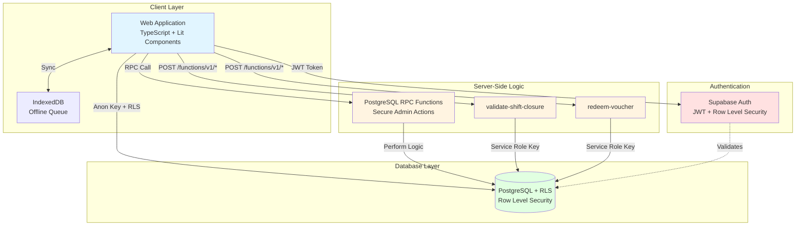

# Portale Distributori Neofuel

[](https://github.com/B00RR/portale-distributori-neofuel/actions)
[](https://github.com/B00RR/portale-distributori-neofuel/actions)
[](https://codecov.io/gh/B00RR/portale-distributori-neofuel)

Sistema di gestione per distributori di carburante Neofuel con focus su sicurezza, affidabilità e manutenibilità.

## 🎯 Caratteristiche Principali

- **Gestione Turni**: Apertura/chiusura con calcoli automatici e discrepanza detection
- **Amministrazione**: Gestione distributori, operatori, isole, pistole, cisterne
- **Voucher System**: Redemption voucher con QR code scanner  
- **Gestione Crediti**: Sistema clienti a credito con movimenti cassa
- **Reporting**: Export PDF/Excel chiusure turno con grafici
- **Multi-ruolo**: Admin, Operatore, Contabilità, Fatturazione

## 🏗️ Architettura

### System Architecture



### Security Layers

1. **Client Layer**: Type-safe TypeScript, input sanitization, client-side rate limiting
2. **Authentication**: JWT verification, session management, role-based access
3. **Server-Side logic**: RPC Functions for admin actions, Edge Functions for complex logic
4. **Database**: Row Level Security (RLS), foreign key constraints, audit logging

### Code Structure

```
js/
├── core/       # Core services, API layer, Auth (100% TS)
├── admin/      # Admin modules (100% TS)
├── operator/   # Operator modules (100% TS)
├── shared/     # State management, error handling (100% TS)
├── ui/         # UI components (Lit + TypeScript)
├── utils/      # Utilities, validators, sanitizers (100% TS)
└── types.ts    # Global type definitions

supabase/
├── functions/  # Edge Functions (Deno + TypeScript)
├── migrations/ # SQL Migrations & RPC Definitions
└── ...
```

### Server-Side API (RPC & Edge Functions)

#### `RPC: admin_delete_closure`
**Purpose**: Secure cascade delete of shift closures
**Auth**: Admin required

#### `RPC: admin_update_price`
**Purpose**: Secure price update with validation
**Auth**: Admin required

#### `POST /functions/v1/validate-shift-closure`
**Purpose**: Server-side validation of shift closure totals  
**Auth**: Required (JWT)  
**Rate Limit**: None (trusted operation)

```typescript
// Request
{
  "shift_id": number,
  "submitted_totals": { ... }
}

// Response
{
  "valid": boolean,
  "discrepancies"?: { ... }
}
```

#### `POST /functions/v1/redeem-voucher`
**Purpose**: Secure voucher redemption with built-in rate limiting  
**Auth**: Required (JWT)  
**Rate Limit**: 10/minute per user

```typescript
// Request
{
  "voucher_code": string,
  "station_id": number
}

// Response
{
  "success": boolean,
  "amount": number
}
```

## 🧪 Testing

**Coverage attuale**: ~70% sui path critici

### Unit & Integration Tests
```bash
npm test                    # Esegui tutti i test
npm run test:watch         # Watch mode
npm run test:coverage      # Coverage report
```

### E2E Tests (Playwright)
```bash
npm run test:e2e           # Headless
npm run test:e2e:headed    # Con browser visibile
npm run test:e2e:ui        # UI mode interattivo
```

**Test Coverage:**
- ✅ Authentication flow
- ✅ Apertura/chiusura turno
- ✅ Admin CRUD operations
- ✅ Voucher redemption
- ✅ Price management

## 🚀 Quick Start

```bash
# Install dependencies
npm install

# Setup environment
cp .env.example .env
# Configura VITE_SUPABASE_URL e VITE_SUPABASE_ANON_KEY

# Run dev server
npm run dev

# Build for production
npm run build
npm run preview
```

## 📦 Stack Tecnologico

- **Frontend**: TypeScript, Vanilla JS, Lit Components
- **Build**: Vite + PWA Support
- **Database**: Supabase (PostgreSQL + RLS)
- **Testing**: Vitest (unit), Playwright (E2E)
- **CI/CD**: GitHub Actions
- **Type Safety**: Strict TypeScript configuration

## 🎨 UI Components

Sistema di componenti riusabili costruito con Lit:

```javascript
import '@ui/components';

// Form field
<form-field
  label="Nome"
  name="name"
  required
  value="${user.name}">
</form-field>

// Data table
<data-table
  .columns="${columns}"
  .data="${users}"
  @row-click="${handleRowClick}">
</data-table>

// Card container
<card-box title="Statistiche" variant="primary">
  <p>Contenuto</p>
</card-box>
```

Vedi [Component Migration Guide](./docs/COMPONENT_MIGRATION.md) per dettagli.

## 📚 Documentazione

- [Component Migration Guide](./docs/COMPONENT_MIGRATION.md) - Migrazione da HTML hardcodato a componenti
- [ROADMAP](./docs/ROADMAP_MIGLIORAMENTI.md) - Roadmap miglioramenti
- [SQL Schema](./sql/) - Schema database e migrations

## 🔒 Sicurezza

- ✅ Row Level Security (RLS) su tutte le tabelle Supabase
- ✅ `escapeHtml()` su tutti gli output dinamici
- ✅ Security audit automatico settimanale
- ✅ Edge Functions per operazioni sensibili

```bash
# Security & Quality Checks
npm run lint          # Check standard (stile + errori)
npm run lint:security # Check vulnerabilità (OWASP)
npm run secure        # Check completo (Audit + Format + Lint)
npm audit fix         # Fix automatico dipendenze
```

## 🤝 Contributing

1. Fork il repository
2. Crea feature branch (`git checkout -b feature/AmazingFeature`)
3. Commit changes (`git commit -m 'Add AmazingFeature'`)
4. Push to branch (`git push origin feature/AmazingFeature`)
5. Open Pull Request

**Before submitting:**
- ✅ Run `npm test` (tutti i test devono passare)
- ✅ Run `npm run test:e2e` (E2E tests devono passare)
- ✅ Code coverage ≥ 70% su nuovi file
- ✅ ESLint clean (`npm run lint`)

## 📊 Code Quality Metrics

| Metrica | Score |
|---------|-------|
| **Overall Quality** | **9/10** ⭐ |
| Test Coverage | 70%+ |
| E2E Tests | 6 scenarios |
| Lighthouse Score | 90+ |
| Security Audit | 0 high/critical |

## 📝 License

Proprietario - Neofuel © 2025

## 👥 Team

Sviluppato con ❤️ dal team Neofuel

---

**Status**: Remediation & Improvements (Phase 11) - In Progress 🚀
